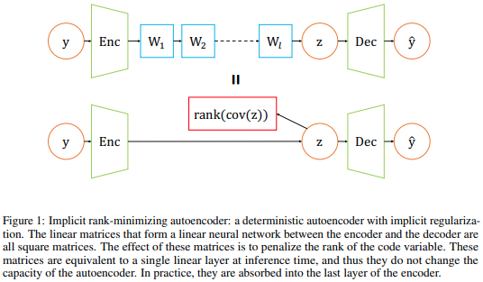

</img>

## Deep Linear Network - Pytorch

A simple to use deep linear network module. Useful for matrix factorization or for passing an input tensor through a series of square weight matrices, where it was discovered that gradient descent implicitly regularizes the output to low-rank solutions.

LeCun's paper uses this unique property to optimize the latent of an autoencoder to be low-rank.

The module will take care of collapsing the linear weight matrices into one weight matrix, caching it across evaluation calls (but expired on training).

## Install

```bash
$ pip install deep-linear-network
```

## Usage

Matrix factorization

```python
import torch
from deep_linear_network import DeepLinear

x = torch.randn(1, 1024, 256)
linear = DeepLinear(256, 10, 512)  # w1 (256 x 10) @ w2 (10 x 512)
linear(x) # (1, 1024, 512)
```

Deep Linear Network

```python
import torch
from deep_linear_network import DeepLinear

x = torch.randn(1, 1024, 256)
linear = DeepLinear(256, 256, 256, 256, 128) # w1-w3 (256 x 256) w4 (256 x 128)
linear(x) # (1, 1024, 128)
```

## Citations

```bibtex
@misc{arora2019implicit,
    title={Implicit Regularization in Deep Matrix Factorization}, 
    author={Sanjeev Arora and Nadav Cohen and Wei Hu and Yuping Luo},
    year={2019},
    eprint={1905.13655},
    archivePrefix={arXiv},
    primaryClass={cs.LG}
}
```

```bibtex
@misc{jing2020implicit,
    title={Implicit Rank-Minimizing Autoencoder}, 
    author={Li Jing and Jure Zbontar and Yann LeCun},
    year={2020},
    eprint={2010.00679},
    archivePrefix={arXiv},
    primaryClass={cs.LG}
}
```
